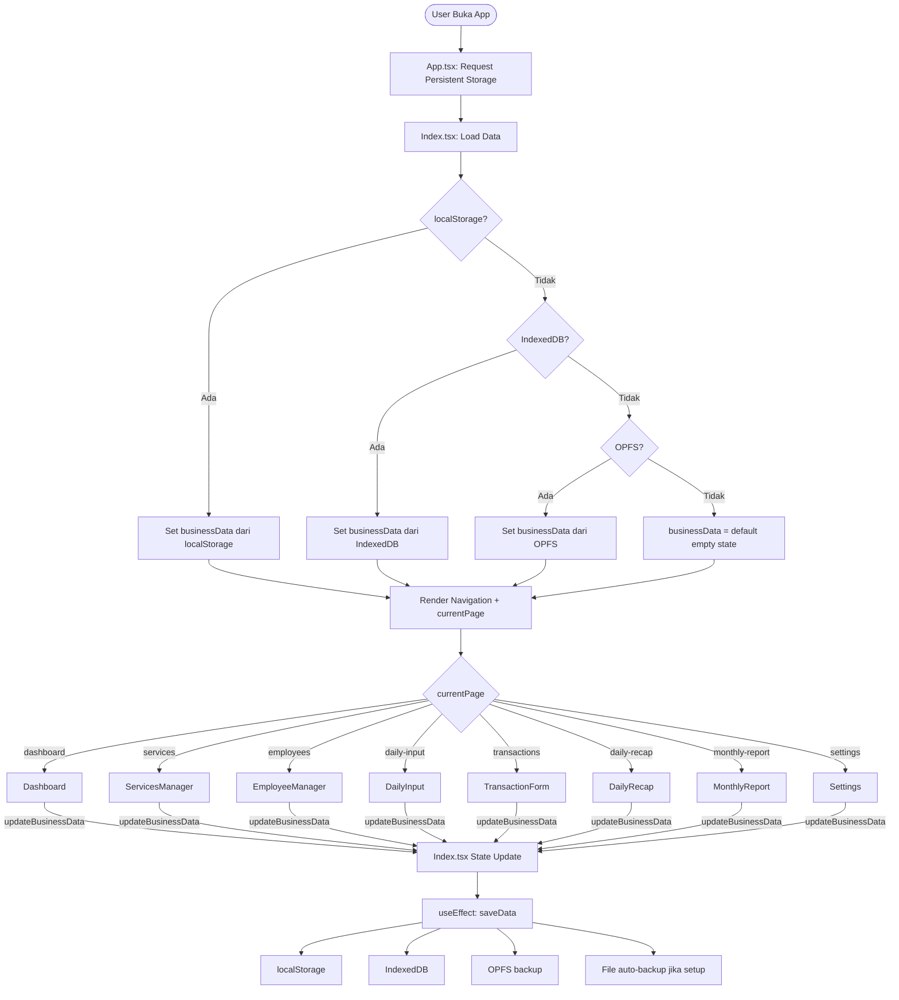
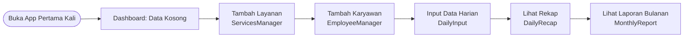
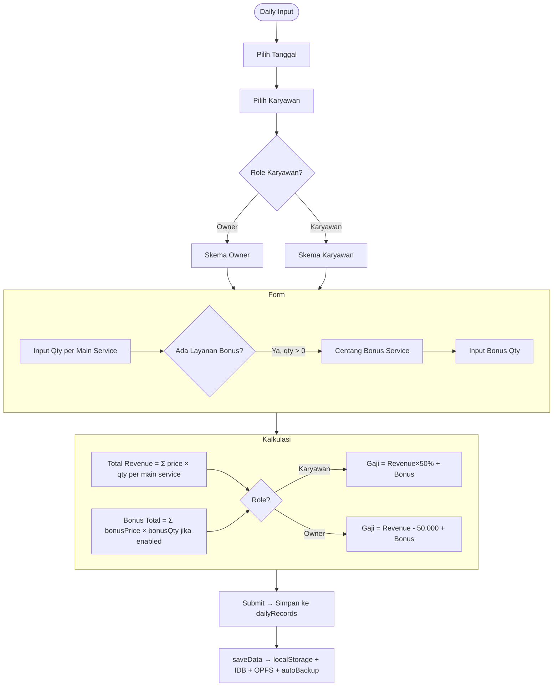
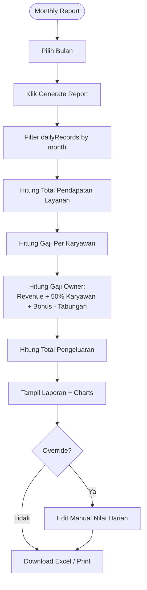
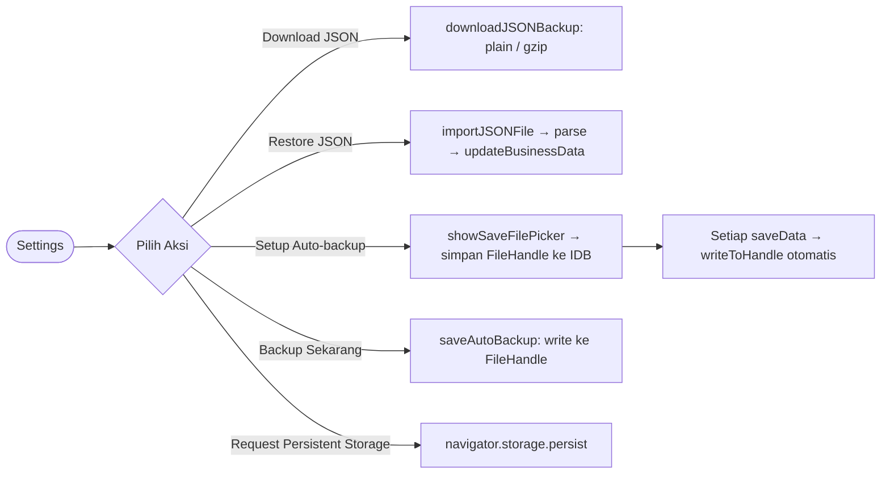

# 📋 Analisis Mendalam Repository: Nekat-Mbois-Bookkeeping

> Ditulis oleh: Senior Fullstack Engineer (10+ tahun pengalaman)
> Tanggal: 11 Juli 2026

---

## 1. 🎯 Tujuan Utama Proyek

### Masalah yang Diselesaikan
Bisnis barbershop skala kecil-menengah (seperti "Nekat Barbershop") kesulitan mencatat pendapatan harian, menghitung gaji karyawan secara otomatis, dan membuat laporan bulanan — selama ini masih manual (buku catatan / Excel).

### Value Proposition / Core Objective
> **"Aplikasi pembukuan digital offline-first untuk barbershop, yang menghitung gaji karyawan & owner secara otomatis berdasarkan layanan yang dikerjakan setiap harinya."**

Fitur utama yang menjadi keunggulan:
- Perhitungan gaji **otomatis** berdasarkan skema bagi hasil: Karyawan (50% layanan + 100% bonus), Owner (sisa 50% karyawan + layanan sendiri - Rp50.000/hari tabungan)
- **Offline-first**: data tersimpan di browser lokal (localStorage → IndexedDB → OPFS) tanpa server
- Backup data berlapis: JSON, JSON Gzip, File System Access API (auto-backup), OPFS

---

## 2. 👤 Target Pengguna

### User Utama
| Tipe | Deskripsi |
|------|-----------|
| **Owner Barbershop** | Pemilik usaha yang perlu memantau pendapatan, gaji, dan laporan bulanan secara cepat tanpa keahlian akuntansi |
| **Kasir / Admin** | Yang menginput data transaksi harian per karyawan |

### Karakteristik Pengguna
- Tidak memiliki latar belakang teknis / akuntansi formal
- Menggunakan smartphone atau laptop/PC biasa
- Tidak butuh server atau cloud — data cukup di perangkat sendiri
- Membutuhkan laporan yang bisa di-download (Excel / JSON) untuk keperluan internal

> ⚠️ **Tidak ada sistem login/autentikasi** — aplikasi ini murni single-user, data personal per perangkat.

---

## 3. ✨ Fitur-fitur Utama

### Core Features (Prioritas Tinggi)

| No | Fitur | File | Fungsi |
|----|-------|------|--------|
| 1 | **Daily Input** | `DailyInput.jsx` | Input transaksi harian per karyawan: layanan dikerjakan, qty, bonus services; hitung gaji otomatis |
| 2 | **Daily Recap** | `DailyRecap.tsx` | Lihat, edit, hapus rekap harian per tanggal; export ke Excel |
| 3 | **Monthly Report** | `MonthlyReport.tsx` | Laporan bulanan: total pendapatan, gaji owner/karyawan, pengeluaran, tabungan; override manual |
| 4 | **Dashboard** | `Dashboard.tsx` | Ringkasan hari ini: total pendapatan layanan + produk, jumlah layanan/karyawan; quick actions |
| 5 | **Data Persistence** | `dataManager.js` | Simpan ke localStorage + IndexedDB + OPFS; auto-backup ke file lokal; gzip compression |

### Supporting Features (Prioritas Menengah)

| No | Fitur | File | Fungsi |
|----|-------|------|--------|
| 6 | **Services Manager** | `ServicesManager.tsx` | CRUD layanan barbershop (nama, harga, flag bonusable) |
| 7 | **Employee Manager** | `EmployeeManager.tsx` | CRUD karyawan (nama, role: Owner/Karyawan) |
| 8 | **Transaction Form** | `TransactionForm.tsx` | Input manual pemasukan/pengeluaran non-layanan |
| 9 | **Settings** | `Settings.jsx` | Nama bisnis, backup/restore JSON, auto-backup, persistent storage, danger zone |

### ⚙️ Skema Perhitungan Gaji (Business Logic Inti)

```
Karyawan:
  Gaji = (Total Revenue Layanan × 50%) + Bonus Layanan

Owner:
  Gaji = Revenue Layanan Sendiri + (Total Revenue Karyawan × 50%) + Bonus - Rp50.000/hari
  Tabungan = Rp50.000 × jumlah hari hadir Owner
```

---

## 4. 🛠 Tech Stack

### Bahasa Pemrograman
- **TypeScript** — mayoritas file baru (`.tsx`)
- **JavaScript** — beberapa file lama (`.jsx`, `dataManager.js`) yang belum dimigrasikan ke TS

### Framework & Library Utama

| Kategori | Teknologi | Versi |
|----------|-----------|-------|
| **Build Tool** | Vite + `@vitejs/plugin-react-swc` | ^5.4.1 |
| **Frontend Framework** | React | ^18.3.1 |
| **Routing** | React Router DOM | ^6.26.2 |
| **UI Component** | shadcn/ui (Radix UI primitives) | berbagai versi |
| **Styling** | Tailwind CSS | ^3.4.11 |
| **Form Management** | React Hook Form + Zod | ^7.53.0 / ^3.23.8 |
| **State Management** | Local state (useState) + React Query (installed, minimal use) | ^5.56.2 |
| **Icons** | Lucide React | ^0.462.0 |
| **Charts** | Recharts | ^2.12.7 |
| **Date** | date-fns | ^3.6.0 |
| **Excel Export** | XLSX (SheetJS) | ^0.18.5 |
| **Toast** | Sonner | ^1.5.0 |
| **Theme** | next-themes | ^0.3.0 |

### Database / Penyimpanan
| Layer | Teknologi | Keterangan |
|-------|-----------|-----------|
| **Primary** | IndexedDB (`businessDB`) | Persisten, kapasitas besar |
| **Fallback** | localStorage | Sinkron, cepat, limit ~5MB |
| **OPFS** | Origin Private File System | Mirror backup otomatis di browser |
| **File** | File System Access API | Auto-backup ke file lokal (Chromium only) |

### Infrastructure / Deployment
- **Platform**: Lovable.dev (AI-powered web app builder)
- **No backend server** — pure frontend SPA
- **Deployment**: Via Lovable publish / custom domain
- **No Docker, no CI/CD** — semua dikelola platform Lovable

---

## 5. 📁 Project Structure & Mapping

```
D:\coding\Nekat-Mbois-bookkeeping/
│
├── 📄 index.html              → Entry HTML, load Vite + Google Fonts
├── 📄 package.json            → Dependencies & scripts
├── 📄 vite.config.ts          → Vite config (plugin react-swc, alias @/)
├── 📄 tailwind.config.ts      → Tema: barbershop palette (red/blue/cream), animasi fade-in
├── 📄 tsconfig.json           → TypeScript root config
├── 📄 components.json         → shadcn/ui config (path alias, style)
│
└── src/
    ├── 📄 main.tsx            → Root mount: <App /> ke #root
    ├── 📄 App.tsx             → Router setup, QueryClientProvider, Toast, persist storage
    ├── 📄 App.css             → Custom CSS utility classes (barbershop-card, barber-pole, hover-lift)
    ├── 📄 index.css           → Tailwind directives + CSS variables (shadcn/ui tokens)
    │
    ├── pages/
    │   ├── 📄 Index.tsx       → ⭐ MAIN SHELL: state management businessData, page routing (switch-case)
    │   ├── 📄 Index.jsx       → [DUPLIKAT JSX lama — perlu dihapus]
    │   └── 📄 NotFound.tsx    → 404 page
    │
    ├── components/
    │   ├── 📄 Dashboard.tsx   → Halaman beranda: stats hari ini + quick action buttons
    │   ├── 📄 Navigation.tsx  → Top navbar: menu desktop + hamburger mobile
    │   ├── 📄 Navigation.jsx  → [DUPLIKAT JSX lama — perlu dihapus]
    │   ├── 📄 DailyInput.jsx  → Form input harian: pilih karyawan + layanan + qty + bonus
    │   ├── 📄 DailyRecap.tsx  → Tabel rekap harian: view/edit/delete per record + Excel export
    │   ├── 📄 DailyRecap.jsx  → [DUPLIKAT JSX lama — perlu dihapus]
    │   ├── 📄 MonthlyReport.tsx → Laporan bulanan: kalkulasi gaji, override manual, charts
    │   ├── 📄 ServicesManager.tsx → CRUD layanan (nama, harga, flag bonusable)
    │   ├── 📄 ServicesManager.jsx → [DUPLIKAT JSX lama — perlu dihapus]
    │   ├── 📄 EmployeeManager.tsx → CRUD karyawan (nama, role Owner/Karyawan)
    │   ├── 📄 EmployeeManager.jsx → [DUPLIKAT JSX lama — perlu dihapus]
    │   ├── 📄 TransactionForm.tsx → Input pemasukan/pengeluaran + daftar 5 transaksi terbaru
    │   ├── 📄 TransactionForm.jsx → [DUPLIKAT JSX lama — perlu dihapus]
    │   ├── 📄 Settings.jsx    → Konfigurasi bisnis, backup/restore, persistent storage
    │   ├── 📄 ProductManager.jsx → [Belum diintegrasikan ke router]
    │   ├── 📄 ProductSales.jsx   → [Belum diintegrasikan ke router]
    │   ├── 📄 Urgent.jsx         → [Belum diintegrasikan ke router]
    │   └── ui/                → Komponen shadcn/ui (Button, Dialog, Toast, Badge, dll)
    │
    ├── hooks/
    │   ├── 📄 use-mobile.tsx  → Hook deteksi viewport mobile (≤768px)
    │   └── 📄 use-toast.ts    → Toast notification state management
    │
    ├── lib/
    │   └── 📄 utils.ts        → shadcn utility: cn() = clsx + tailwind-merge
    │
    └── utils/
        └── 📄 dataManager.js  → ⭐ CORE DATA LAYER:
                                  - IndexedDB helpers (openDB, idbGet, idbSet)
                                  - OPFS helpers (writeOPFSBackup, loadDataFromOPFS)
                                  - File System Access API (requestAutoBackupFile, saveAutoBackup)
                                  - Gzip compression (CompressionStream / DecompressionStream)
                                  - loadData / saveData (orchestrator multi-layer)
                                  - Kalkulasi: getTodayTotal, getTodayProductSales
                                  - Export: exportToCSV, exportDailyRecapToExcel, downloadJSONBackup
                                  - Import: importJSONFile
```

---

## 6. 🔄 User Flow & Alur Logika

### Flow Utama Aplikasi



### Flow Setup Awal (First Time Use)



### Flow Input Harian (Core Path)



### Flow Laporan Bulanan



### Flow Backup & Restore



---

## 7. 📝 Catatan Tambahan

### Pola Arsitektur
- **Single Page Application (SPA)** dengan React Router DOM
- **Lifting State Up** — semua state dipusatkan di `Index.tsx` (`businessData`), diteruskan ke child via props
- **Tidak ada global state manager** (Redux/Zustand) — React Query diinstall tapi nyaris tidak digunakan
- **Tidak ada backend / API** — murni client-side dengan browser storage
- **No Authentication** — tidak ada login/logout

### Cara Menjalankan Proyek

```bash
# Install dependencies
npm install
# atau dengan bun (lebih cepat, ada bun.lockb)
bun install

# Development server
npm run dev
# → http://localhost:8080 (default Vite)

# Build production
npm run build

# Lint
npm run lint
```

---

### ⚠️ Area Kompleks / Perlu Perhatian Khusus

#### 1. **Duplikasi File JSX ↔ TSX** 🔴 Kritis
Hampir setiap komponen memiliki dua versi:
- `Navigation.jsx` & `Navigation.tsx`
- `DailyRecap.jsx` & `DailyRecap.tsx`
- `ServicesManager.jsx` & `ServicesManager.tsx`
- `EmployeeManager.jsx` & `EmployeeManager.tsx`
- `TransactionForm.jsx` & `TransactionForm.tsx`
- `Index.jsx` & `Index.tsx`

**Risiko**: Kebingungan file mana yang aktif diimport, potensi bug berbeda di dua versi.
**Rekomendasi**: Hapus semua `.jsx` yang sudah ada versi `.tsx`-nya.

#### 2. **File Tidak Terintegrasi ke Router** 🟡 Perlu Perhatian
- `ProductManager.jsx` — ada di komponen tapi tidak ada route di `Index.tsx`
- `ProductSales.jsx` — sama
- `Urgent.jsx` — sama
- `Settings.jsx` — masih `.jsx`, belum di-TypeScript-kan

#### 3. **`dataManager.js` Masih JavaScript** 🟡 
File paling krusial (data layer) tidak memiliki TypeScript types. Perlu dimigrasikan ke `.ts` dengan proper interface.

#### 4. **Business Logic Tersebar** 🟡
Kalkulasi gaji yang sama diulang di:
- `DailyInput.jsx` (useEffect kalkulasi)
- `dataManager.js` (getTodayTotal, exportDailyRecapToExcel)
- `MonthlyReport.tsx` (calculateMonthlyReport)

Ini **melanggar DRY** — logika gaji harus di satu tempat.

#### 5. **`console.log` Debug Tertinggal** 🟢 Minor
Di `MonthlyReport.tsx` baris 129 dan 147 masih ada `console.log('🔍 DEBUG: ...')` yang seharusnya dihapus dari production.

#### 6. **ID Menggunakan `Date.now()`** 🟢 Minor
ID untuk services, employees, dan transactions menggunakan `Date.now().toString()`. Rentan collision jika data dibuat sangat cepat. Sebaiknya gunakan `crypto.randomUUID()`.

---

### 💡 Rekomendasi Perbaikan (Berdasarkan Prinsip DRY, KISS, Modular)

#### Prioritas 1 — Bersihkan Duplikasi
```bash
# Hapus file JSX yang sudah ada versi TSX-nya
src/pages/Index.jsx
src/components/Navigation.jsx
src/components/DailyRecap.jsx
src/components/ServicesManager.jsx
src/components/EmployeeManager.jsx
src/components/TransactionForm.jsx
```

#### Prioritas 2 — Ekstrak Business Logic ke Satu Tempat
Buat `src/utils/salaryCalculator.ts`:
```typescript
// SATU sumber kebenaran untuk semua kalkulasi gaji
export const calculateEmployeeSalary = (revenue: number, bonus: number, role: 'Owner' | 'Karyawan') => {
  if (role === 'Karyawan') return revenue * 0.5 + bonus;
  if (role === 'Owner') return revenue - 50_000 + bonus;
  return 0;
};
```

#### Prioritas 3 — Migrasi `dataManager.js` → `dataManager.ts`
Tambahkan interface `BusinessData`, `DailyRecord`, `Service`, `Employee`, dll.

#### Prioritas 4 — Ganti `Date.now()` dengan UUID
```typescript
id: crypto.randomUUID()
```

#### Prioritas 5 — Hapus `console.log` Debug
Di `MonthlyReport.tsx` baris 129, 147-151.

#### Prioritas 6 — Ganti `alert()` / `confirm()` dengan UI Komponen
Semua `alert()`, `window.confirm()` di Settings, DailyInput, dll seharusnya diganti dengan shadcn `AlertDialog` yang sudah terinstall — lebih konsisten UX dan bisa dikustomisasi.

---

### 📊 Ringkasan Kesehatan Kode

| Aspek | Status | Keterangan |
|-------|--------|-----------|
| Modularitas | 🟡 Cukup | Struktur folder baik, tapi ada file orphan |
| DRY | 🔴 Perlu Perbaikan | Business logic duplikasi di 3 tempat |
| TypeScript | 🟡 Sebagian | ~60% sudah TS, sisanya masih JS |
| Duplikasi File | 🔴 Ada | 6 pasang file JSX/TSX paralel |
| State Management | 🟢 Sederhana & Bersih | Lifting state up sudah tepat untuk skala ini |
| Data Persistence | 🟢 Sangat Baik | Triple-layer storage + auto-backup inovatif |
| UI/UX | 🟢 Baik | shadcn/ui + Tailwind konsisten, responsive |
| Performance | 🟢 Baik | Vite SWC, lazy XLSX import, minimal re-render |
| Security | 🟡 N/A | No auth by design (offline tool) |
